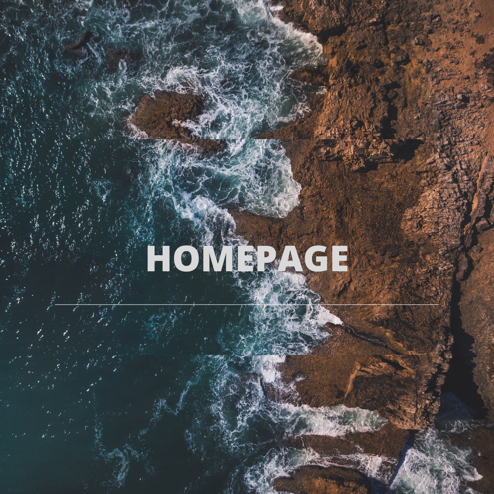

# Demo
## My first coding course website:
https://andriistafiniak.github.io/homePage/

## Technologies used:
- HTML
- CSS
- JS
- BEM convention

## Description:
This is my first project. It's not perfect at the moment but I'll improve it. I promise 😃

## What interesting:
If you click on the button <<Włącz jasny/ciemny motyw>> you will change the background.

